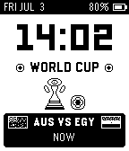
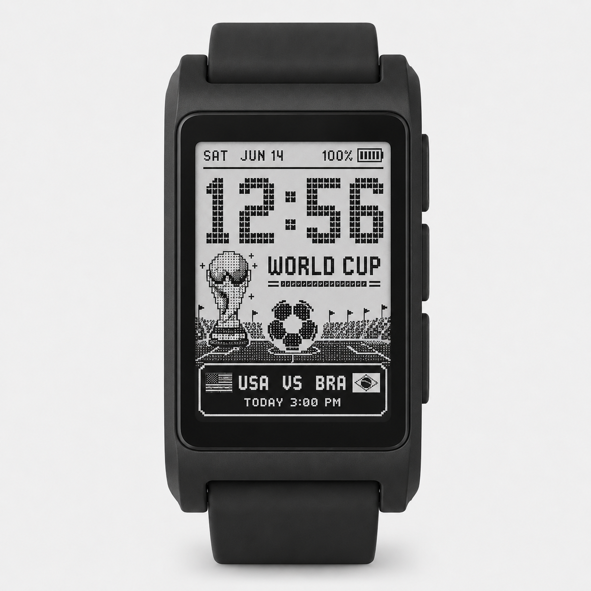

# pebble-worldcup

A Pebble 2 Duo (flint) watchface showing the time plus the current or next
FIFA World Cup 2026 match, fetched from
[openfootball/worldcup.json](https://github.com/openfootball/worldcup.json)
by the phone and cached on the watch.

## Screenshots

**Actual emulator status**



**Generated product render**



Design spec: `docs/superpowers/specs/2026-07-03-worldcup-watchface-design.md`.

## Features

- Shows the current or next World Cup match with team flags, team codes, and kickoff text.
- Caches the latest match payload on the watch so the face still renders without the phone.
- Flicking the wrist steps forward through upcoming matches; the match box shows a `+N`
  marker while browsing and snaps back to the soonest match after 10 seconds.
- Kickoffs more than a week away use month/day labels, such as `JUL 19`, instead of
  ambiguous weekday names.
- Targets both Pebble 2 Duo (`flint`) and Pebble Time 2 (`emery`).

## Cloning

This repo uses a git submodule for [PebbleOS](https://github.com/coredevices/PebbleOS) at `resources/PebbleOS`. After cloning, initialize it:

```sh
git clone --recurse-submodules <this-repo-url>
# or, if already cloned without --recurse-submodules:
git submodule update --init --recursive
```

To pull submodule updates later:

```sh
git submodule update --remote --merge
```

## Building & running

    pebble build                          # build for flint and emery
    pebble install --emulator flint       # run on the Pebble 2 Duo emulator
    pebble install --cloudpebble          # install on a real watch via the cloud

## Tests

    node tools/test_parser.js             # pure JS parse/filter/encode units
    node tools/test_fixture.js            # end-to-end against the pinned fixture

## Regenerating assets and data

    node tools/gen_teams.js               # src/pkjs/teams.js from tools/worldcup.teams.json
    python3 tools/gen_art.py              # hand-drawn 1-bit art PNGs
    python3 tools/gen_flags.py            # 48 team flags + flag_resources.h + package.json media

All generated outputs are committed; the scripts are run manually when the
team list changes.

## Project layout

    src/c/            watch-side C (worldcup.c UI, match_store.c data/persist)
    src/pkjs/         phone-side JS (index.js app, parser.js pure logic, teams.js generated)
    tools/            generators, tests, fixtures
    resources/images/ bundled 1-bit bitmaps (generated)
    resources/        also holds vendored reference material (see resources/CLAUDE.md)
