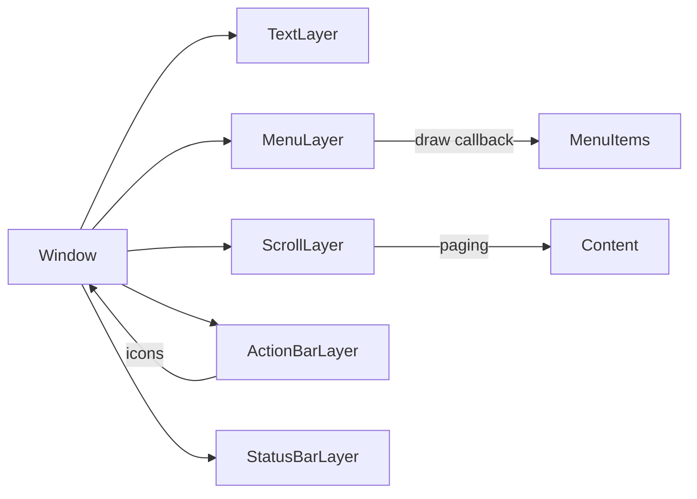
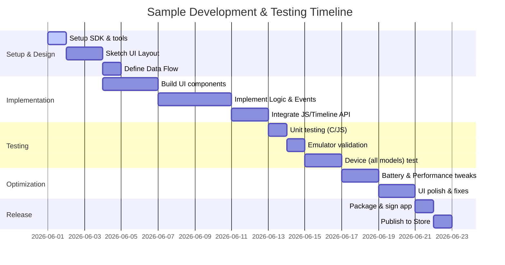

# Pebble Smartwatch App Programming: Best Practices

**Executive Summary:** Pebble apps and watchfaces must balance rich functionality with the platform’s tight constraints (small screens, limited memory/battery, and varied hardware). Design should focus on *glanceable*, minimal UIs with high contrast and large typography, using standard SDK widgets (menus, cards, ActionBar) where possible【3†L72-L84】【39†L183-L191】. In code, exploit compile-time macros (e.g. `PBL_IF_COLOR_ELSE`) to adapt to B/W vs color hardware【1†L89-L95】【1†L99-L102】. Conserve power by minimizing wake-ups (e.g. subscribe only to `MINUTE_UNIT` ticks, not seconds【6†L107-L115】), batching sensor updates, and limiting Bluetooth/vibration use【6†L69-L77】【8†L179-L188】. For color Pebbles, remember the 64‐color palette (2 bits per R/G/B channel)【42†L185-L193】 and use color only for meaningfully distinct information (avoid red/green cues alone【3†L86-L90】). Test on all screen shapes (round vs rectangular) and in motion. Use logging and the CLI’s tools (`pebble install`, `pebble logs`) for debugging【45†L112-L120】【45†L139-L147】. Following guidelines from Pebble’s documentation and high-level smartwatch HIGs (Apple watchOS, Wear OS) ensures legibility, fast interactions, and consistent UI patterns【20†L95-L102】【17†L557-L566】.

## Platform Constraints & Hardware Differences

Pebble devices vary widely. A summary of key specs is in the Pebble docs【31†L76-L83】:

| Platform (Models)              | Screen      | Colors    | Max App (code+heap) | Available RAM     |
| ------------------------------ | ----------- | --------- | ------------------- | ----------------- |
| **Aplite** (Pebble Classic/Steel) | 144×168 B×W | 1‑bit B/W | 24 KB               | ~96 KB Flash      |
| **Basalt** (Pebble Time/Steel)    | 144×168     | 64-color  | 64 KB               | ~256 KB Flash     |
| **Chalk** (Pebble Time Round)     | 180×180     | 1‑bit B/W | 128 KB              | ~256 KB Flash     |
| **Diorite/Flint** (Pebble 2/2 Duo) | 200×228     | 64-color  | 128 KB              | (Star-MC1 240MHz) |
| *(Emery – Time 2)*               | *round?*    | *64-color*| *128 KB*            | *~256 KB Flash*   |

*Table: Pebble platforms differ in shape, resolution, color depth, and memory. Color-capable models support 64 colors (2 bits per RGB channel)【42†L185-L193】. (Data from Pebble Hardware Info【31†L76-L83】.)* 

**Memory & Resources:** Each app is limited to 256 KB of flash resources on Basalt/Chalk (144×168 color or 180×180 mono) and 128 KB on Aplite (B/W)【48†L64-L72】. Only 256 resource files (images, fonts, etc.) are allowed【48†L64-L72】. Code + heap size is ~24 KB on Aplite vs 64–128 KB on newer boards【31†L76-L83】. *Best Practice:* Minimize images/fonts size, load only essential resources, and free unused layers/windows to fit these limits. Use `heap_bytes_free()` to monitor memory. The system logs heap usage at exit, which helps detect leaks【45†L122-L131】.

## Development Stack: SDK, APIs & Tools

**Pebble SDK & RTOS:** Apps are written in C (SDK 3/4) or JavaScript (PebbleKit JS). The RTOS is proprietary but supports a Window/Layer UI system. Leverage system UI elements (see UI Patterns below) and services (Accelerometer, AppMessage, etc.). Use **compile-time defines** to tailor behavior per hardware. For example:
```c
#if defined(PBL_COLOR)
  text_layer_set_text_color(layer, GColorRed);
#else
  text_layer_set_text_color(layer, GColorWhite);
#endif

window_set_background_color(window, PBL_IF_COLOR_ELSE(GColorJaegerGreen, GColorBlack));
```
This ensures legibility on both color and monochrome screens【1†L89-L95】【1†L99-L102】. The common system font (“Raster Gothic Condensed”) is optimized for Pebble’s displays【34†L133-L136】. Custom fonts may be used but consume RAM. The SDK provides `fonts_get_system_font` and `fonts_load_custom_font` APIs【34†L129-L138】.

**PebbleKit JS & Cloud APIs:** A Pebble app can include a phone-side JS component. Use **Pebble.sendAppMessage()** in JS to communicate with the watch【45†L98-L105】. JS code can fetch web data (HTTP) using AJAX. The watch’s REST-like **Timeline Web API** lets your server push “pins” (events/notifications) to users’ watches【22†L54-L63】. For example, send a JS message to the watch:
```js
console.log('Sending data to Pebble...');
Pebble.sendAppMessage({'KEY': value},
  function(e) { console.log('Send successful!'); },
  function(e) { console.log('Send FAILED!'); }
);
```
【45†L98-L105】. **Pins** (see Timeline below) are JSON objects with title, time, icons, colors, actions, etc.【23†L72-L81】【23†L130-L139】. Manage communications carefully: large or frequent AppMessages can drain power and must be batched or throttled. Always check `AppMessage` success/failure callbacks and cache data locally (Storage API) to avoid unnecessary round-trips【6†L125-L134】【8†L179-L188】.

**Workflow & Tools:** Use the `pebble` command-line tool for building, installing, and debugging. E.g. `pebble build`, `pebble install --emulator basalt` (run on simulator), or `pebble install --phone` (install on device). Enable Developer Connection on your phone to use `pebble logs`; for example `pebble install --logs` to install and stream logs. In C, use `APP_LOG()` to print debug info; in JS use `console.log()`. All logs (C and JS) appear via `pebble logs`【45†L112-L120】. Note: logging over Bluetooth is costly in power【45†L139-L147】, so disable verbose logs before releasing. You can also use GDB on the emulator for stepping through code【44†L69-L77】. The SDK includes a Timeline timeline (timeline Pins) simulator that refreshes every 30s (no internet needed)【21†L0-L7】. 

<div style="page-break-after: always;"></div>

## UI Elements & Interaction Patterns

**Standard Widgets (STK):** Favor built-in UI layers instead of custom drawing. Key components:
- **Window/Layer**: Each screen is a `Window` containing one or more `Layer`s.
- **TextLayer:** For text. Use system fonts (see above) and center/alignment as needed.
- **MenuLayer/SimpleMenuLayer:** For lists or options. A `MenuLayer` supports sections, optional icons, titles/subtitles【39†L183-L192】. Example code:
  ```c
  menu_cell_basic_draw(ctx, cell_layer, "Item Title", "Subtitle", icon_bitmap);
  ```
  This draws 24pt title + 18pt subtitle font【39†L183-L192】 and an icon. Menu headers use 14pt text【39†L238-L240】. The SDK also offers helper cell-drawing functions (basic, title-only)【39†L183-L192】【39†L238-L240】.
- **ActionBarLayer:** A vertical bar (30px wide) on the right with up to 3 icons/buttons【35†L124-L132】. Use it for the 2–3 primary actions (back, select, etc). It provides feed-forward (hint icons) for button functions. If you have >3 actions, put the less-used in a menu. Icons should be clear (no wider than 28×18 px, ideally ~15×15 px core)【36†L1-L4】. Example:
  ```c
  action_bar_layer_set_icon(action_bar, BUTTON_ID_UP,   your_icon_up);
  action_bar_layer_set_icon(action_bar, BUTTON_ID_SELECT, your_icon_select);
  ```
- **StatusBarLayer:** Shows system status (time, Bluetooth, battery). Use it at top when you want to mimic the watchface glance.
- **ScrollLayer/ScrollWheel:** For text or images that overflow. On round screens, use “pagination” (page-by-page scroll) to avoid continuous reflow【26†L98-L107】. Use `content_indicator` arrows to hint more content【26†L112-L121】.

**Recommended Patterns:** Pebble’s guides emphasize *simplicity* and *consistency*【3†L72-L84】【20†L95-L102】. Only display what’s needed now, with a clear hierarchy of importance【3†L72-L80】【20†L95-L102】. For example:
- **Cards style:** Instead of multi-level menus, a single Window showing a “card” of data (multiple fields) that you navigate by up/down【3†L129-L138】. (Pebble’s **Cards-example** shows weather data in one view, scrolled by location【3†L133-L140】.)
- **Lists/Menus:** Standard vertical list of options is familiar and works well【3†L144-L153】. Use icons for common actions.
- **Action Bar:** For 3 quick actions (e.g. Next/Prev/Add), use an `ActionBarLayer` with icons and button clicks【35†L124-L132】.
- **Forms/Input:** Use `NumberWindow` for numeric entry, `TextInput` or long-press for text/dictation when needed.
- **Feedback:** Always provide immediate feedback (e.g. UI update or vibration) for button presses【3†L92-L96】.
- **Navigation:** Make sure Up/Down/Select button behavior is intuitive (up=previous, down=next)【3†L99-L108】 and consistent across your app. If tasks are repeated, preserve state (persist last selection) so the user doesn’t re-navigate every launch【3†L116-L124】.

**Example – Good Design:** In [Terry Yuen’s watchface case study][29], the developer improved legibility by *increasing stroke weight and adding numeric markers*. Originally thin hands were unreadable in dim light, so he made the minute hand stretch to the edge and added prominent quarter-hour numbers (a graphic background)【29†L63-L72】【29†L78-L86】. The hour hand was given a “pill” shape with a cut-out to distinguish it from the minute hand at the center【29†L128-L136】. This made the watch readable “even when out of focus”【29†L70-L72】. 

**Example – Bad Design (Pitfalls):** Avoid clutter and tiny text. For instance, a common mistake is packing a menu with many sub-menus or small font labels. Another is relying on color alone for meaning (bad for colorblind users and monochrome screens)【3†L86-L90】. Avoid using the Pebble’s small buttons for non-standard gestures (only Up/Down/Select)【3†L100-L108】; don’t require complex multi-step input on the watch. 



*Diagram: Typical Pebble UI structure. A `Window` may contain text, menu, scroll, or action-bar layers. The ActionBar provides hint icons on the side. Menu items and scroll content are drawn via callbacks.*

## Layout, Typography & Iconography

**Small Screen Guidelines:** Follow general smartwatch HIGs. Only show the most essential info at a glance【20†L95-L102】【17†L557-L566】. Use large, legible type: system menus use ~28 pt for titles and ≥18 pt for secondary text【3†L82-L84】【39†L183-L192】. The built-in fonts are pixel-optimized (e.g. 24pt, 18pt, 14pt variants in Raster Gothic)【39†L183-L192】【39†L238-L240】. As a rule, **≥28 pt** for primary text, ≥18 pt for any detail (the SDK’s `menu_cell_basic_draw` uses exactly 24pt/18pt)【39†L183-L192】. Ensure **high contrast**: on B/W Pebbles, typically white text on black (or vice versa). Use `gcolor_legible_over()` to pick a contrasting text color for any background【27†L152-L156】. On color Pebbles, avoid hard-to-read combos (e.g. dark text on dark color). For icons and graphics, stick to simple shapes. ActionBar icons should have a clear “visual core” (~15×15px) and not exceed ~28×18px【36†L1-L4】. Menu icons are typically ~24×24px.

**Round vs Rectangular:** The Time Round (Chalk) requires special handling【26†L66-L75】. Leave a 2px margin around edges for the bezel【26†L66-L74】. Menus on round screens are “center-focused”: highlight moves to center and you can use that extra space for that item【26†L79-L87】. Text scrolls by pages, not smooth scroll, to avoid confusing reflow【26†L98-L107】. Use the `ContentIndicator` (up/down arrows) to show more content【26†L112-L121】. Consider alternative layouts when needed – don’t blindly port a rectangular design; e.g. a wide horizontal layout might be split into steps on round devices【26†L125-L133】.

## Color and Graphics

**Monochrome (B/W) Constraints:** Many Pebbles (Classic, Steel, Time Round) are B/W. You only have two colors plus “clear” transparency. Use black/white inversely to maximize contrast. Since many images or fonts assume white-on-black, test your watchface on both backgrounds. Use the macros `PBL_IF_BW_ELSE` or `PBL_IF_COLOR_ELSE` to unify colors across devices【1†L89-L95】【1†L99-L102】. Because B/W has no grayscale, small details can lose meaning – prefer solid shapes and thick strokes.

**Color Pebble (Time, Pebble 2, Time 2):** Color is 2 bits per channel (R/G/B), totaling 64 colors【42†L185-L193】. In other words, each RGB component can be 0 (off), 1 (dark), 2 (medium), or 3 (full)【42†L185-L193】, giving combinations like #AA5500 etc. Note that the displayed colors tend to look pastel under ambient light【42†L185-L193】, so pick contrasting hues and don’t rely on, say, red/green differences alone (users with red-green color blindness would be confused). **Color Palette:** The SDK supports a set of named GColor constants and direct hex strings. Use a limited palette and consider dithering images to mimic more shades. (Pebble’s GBitmap APIs allow palette adjustments at runtime if needed.) The Timeline layout JSON even supports `primaryColor`, `secondaryColor`, and `backgroundColor` fields【23†L130-L139】. Always use `gcolor_legible_over()` when overlaying text on a color background to ensure readability【27†L152-L156】.

**Dithering & Battery:** On color screens, subtle gradients require dithering. Tools like GDither or the GBitmap palette manipulator can help. However, keep graphics simple to save RAM and CPU. Darker pixels on Pebble’s LCD do **not** save power (backlight is on regardless), but extremely bright backlight usage does drain battery【8†L203-L211】. Avoid forcing the backlight on except very briefly (and always `light_enable(false)` after)【8†L203-L211】.

## Performance, Memory & Battery Optimization

Pebble apps must be lean. **Update Sparingly:** Don’t wake the CPU unnecessarily. For watchfaces, use the slowest tick interval that works (minute updates instead of seconds)【6†L107-L115】. *Example:* only update time/animations when `tick_time->tm_sec == 0`【6†L69-L77】:
```c
tick_timer_service_subscribe(MINUTE_UNIT, tick_handler);
static void tick_handler(struct tm *tick_time, TimeUnits changed) {
  // Update display once a minute (sec == 0)
  if(tick_time->tm_sec == 0) { update_time_display(); }
}
```
This keeps the watch asleep ~59× longer, vastly extending battery life【6†L69-L77】. Only use `SECOND_UNIT` if your app *truly* needs per-second updates (e.g. a stopwatch). Allow users to disable any non-essential animation/second hand to save power.

**Animations:** Each frame costs wake time. Use `Animation`/`PropertyAnimation` APIs to create smooth movements【5†L58-L67】【5†L68-L77】. But animate infrequently: e.g., animate on wrist raise or tap, not every second【6†L69-L77】. If animating a countdown or clock, consider a lower frame rate (~15–20 FPS) to save CPU. Register animation handlers if needed, but avoid long-running loops. Use `Timer` with reasonable intervals for manual animation loops and invalidate layers only when content changes.

**Sensors & Communication:** Batch accelerometer/compass readings to reduce wakeups【6†L125-L134】. For example, set `ACCEL_SAMPLING_10HZ` and request 10 samples per callback so the app wakes ~1× per second【6†L134-L142】. Only listen to sensor taps (`accel_tap_service_subscribe`) when needed. Avoid continuous compass or heart-rate monitoring unless the app is actively using it.

**Bluetooth & AppMessage:** Frequent AppMessage activity forces the BT chip to stay in high-power mode【8†L174-L183】. Use the default `SNIFF_INTERVAL_NORMAL` and batch data. For example, cache weather data and only send hourly updates. If you must send large data, switch to `SNIFF_INTERVAL_REDUCED` and back when done【8†L179-L188】. Minimize JSON/message size (compact keys). Give the user feedback (vibration/icon) only when necessary.

**Backlight & Vibration:** The backlight LED is power-hungry【8†L203-L211】. Design your UI so that as few buttons need pressing as possible (e.g. use `ActionBarLayer` for quick access rather than deep menus)【8†L195-L204】. If you do use `light_enable(true)`, turn it off promptly. Vibration (haptic motor) also draws significant current【8†L212-L219】. Use short patterns and let the user disable alerts. Save haptics for truly important notifications (like timers or errors). Provide *optional* haptic settings. For accessibility, use distinct patterns (e.g. one short buzz vs. two quick buzzes) to convey different events when possible.

<div style="page-break-after: always;"></div>

## Accessibility & Internationalization

**Legibility:** Follow general guidelines for all users. Ensure text is large and contrasty. For colorblind users, don’t rely solely on color cues (e.g. red-green); accompany with symbols or text. Use `gcolor_legible_over()` for text on colored backgrounds【27†L152-L156】. For global audiences, remember Pebble supports UTF-8; use system fonts for Western scripts, or custom fonts for CJK (but beware memory).

**Haptics & Sound:** Though Pebble has no speaker (except Time 2), use vibration for feedback. A single short pulse can confirm success; longer buzz or repeats can signal alerts. Keep it meaningful but subtle. Respect quiet modes. 

**User Input:** Use intuitive methods. For text entry, voice dictation is available on microphone models via `dictation_session_start()`【24†L119-L128】. Always confirm before accepting dictation, and fall back to multiple-choice or number wheels if dictation fails. For touch models, support touch scrolling (in SDK calls) and large touch targets. Consider haptic feedback on button presses to reinforce the action. 

**Testing in Context:** People use watches on the move. Test your app while walking or performing tasks. Ensure it works even with one hand (button access) and in different lighting (glare vs dark).

## Testing, Debugging & Workflow

**Emulator vs Device:** Always test on the official emulator (runs C code) and on actual hardware (via USB/Dev Connection). Different models behave differently (especially round screens). Use `pebble install --emulator <platform>` and `pebble install --phone` for each target. 

**Logging:** Use `APP_LOG()` (C) and `console.log()` (JS) during development to track behavior【45†L65-L75】【45†L90-L98】. For example:
```c
APP_LOG(APP_LOG_LEVEL_DEBUG, "Sensor data: x=%d, y=%d, z=%d", data.x, data.y, data.z);
```
Logs appear via `pebble logs`. Beware that heavy logging slows AppMessage and burns battery【45†L139-L147】 – remove or disable verbose logs in production. 

**Breakpoints & Profiling:** The emulator allows GDB debugging【44†L69-L77】. Use it to step through crashes. The build artifacts also include a “Size” report (heap/stack usage) after each run【45†L122-L131】. Monitor heap usage to catch leaks (e.g. always call `window_destroy()` after `window_create()`). 

**Automation & Sideloading:** Use a continuous integration or your development workflow to compile/test across all platforms. For rapid iteration, CloudPebble (web IDE) or the command line can incrementally update an app on your phone/watch. 

## Packaging, App Size & Updates

**PBW Packaging:** The compiled app and resources are bundled into a `.pbw` file. Minimize it by compressing images (PNG with palette), trimming unused sprite frames, and removing debug symbols. Limit custom fonts (each font consumes flash/ram). The App Store imposes an overall 50MB upload limit, but individual apps must fit device constraints (see “Resources” above【48†L64-L72】). 

**Versioning:** Bump version numbers in `package.json`. Users get updates via the Pebble (Rebble) app store or Sideload. There is no “hot code push” – updates require a new PBW. For dynamic content, rely on timeline pins or phone-connected JS. 

**Timeline Publishing:** If your app uses Pebble’s Timeline, you must enable it in the Developer Portal (which gives you API keys)【22†L84-L93】. Pins pushed in sandbox (development) will reach testers; in production, use production keys【22†L98-L107】. Always handle user subscription preferences (using the JS subscriptions API) so pins aren’t spammy.

## Example Good vs Bad Designs

- **Good:** *Clean, high-contrast dial.* The “Readable” watchface increased hand thickness and added quarter-hour numerals【29†L63-L72】【29†L90-L98】. This focused the UI on what the user actually needs (time) and made it legible even under low light or at an angle【29†L70-L72】【29†L95-L100】. It used Pebble’s strengths (simple shapes, bitmaps for non-varying details) and avoided complexity.  
- **Bad:** *Cluttered multi-screen flows.* For instance, a weather app that requires 3 menu taps to view current conditions interrupts the glanceable experience. Or a watchface with small icons and grey-on-black text becomes unusable outdoors. Another bad practice is using many vivid colors to differentiate elements on a monochrome device – it simply shows as uniform grey, confusing users. 

## Checklists & Best Practices

- **Design:** Use simple layouts. Show only essential info (title, big number, status). Favor scrolling cards or lists over deep menus【3†L129-L138】. Ensure large touch/button targets. Use familiar icons and text cues【3†L99-L108】. Provide direct feedback (visual blink, vibration) on interaction【3†L92-L96】. For round screens, respect margins and use pagination【26†L66-L75】【26†L98-L107】.  
- **UI:** Use system fonts (Raster Gothic) at recommended sizes: ~28pt for headers/titles, 24pt for main menu items, 18pt for subtitles, 14pt for captions【39†L183-L192】【39†L238-L240】. Icon graphics should be clear: ActionBar icons ~15×15px core (max 28×18px)【36†L1-L4】; menu icons ~24×24px. For color devices, pick a harmonious palette, but test for sufficient contrast (e.g. `gcolor_legible_over()` assists here【27†L152-L156】).  
- **Battery/Performance:** Update only when needed. Prefer `tick_timer_service_subscribe(MINUTE_UNIT, ...)` over SECOND_UNIT【6†L107-L115】. Batch sensors, and limit use of `Light` and `Vibes` APIs (allow user disable). If animating, trigger on events or at most once per minute【6†L69-L77】. Profile your app’s heap usage and CPU (use logs or a profiler on emulator). Avoid heavy libraries or strings.  
- **Code:** Use `Window` stacks and `Window handlers` correctly. Register `click_config_provider` for each window. For layouts, use `layer_add_child()` to stack layers. Always call `XXX_destroy()` for created UI objects. Use persistent storage (Storage API) for state to speed up startup. Optimize string operations: prefer `snprintf` to format into fixed buffers vs dynamic `strcat`.  
- **Connectivity:** Use AppMessage sparingly. Compress payloads (e.g. small JSON) and send asynchronously. Handle `app_message_outbox_failed` to retry or log errors. Use the Timeline API for long-term notifications if appropriate (e.g. upcoming calendar events, achievements)【22†L54-L63】【23†L72-L81】.  
- **Debugging:** In development builds, sprinkle `APP_LOG()` (C) or `console.log()` (JS) statements, then remove for release to save space. Test every build on all target hardware (aplite/basalt/chalk). Use `pebble logs` to monitor crashes or message failures. Keep an eye on heap usage from logs【45†L122-L131】.  
- **Accessibility:** Provide haptic alternatives to visual notifications. Avoid small text, ensure contrast. Test with “Invert Colors” modes (if available on the phone app). Support vibration on button presses for confirmation.  
- **Publishing:** Before submission, double-check resource limits (keep under 128KB/256KB)【48†L64-L72】 and test Sideload and Store installations. Update appstore metadata (version, description, screenshots) and consider user reports for future UX tweaks.



*Diagram: A sample development timeline. Actual durations may vary.*

**Sources:** This guide synthesizes official Pebble documentation and community expertise (Rebble developer guides【3†L72-L84】【26†L66-L75】, SDK references【39†L183-L192】【45†L139-L147】), along with general smartwatch UX standards (Apple Watch HIG【20†L95-L102】, Wear OS Material guidelines【17†L557-L566】) and real-world examples【29†L63-L72】【42†L185-L193】. Each recommendation is grounded in these sources, aiming for a thorough developer resource.