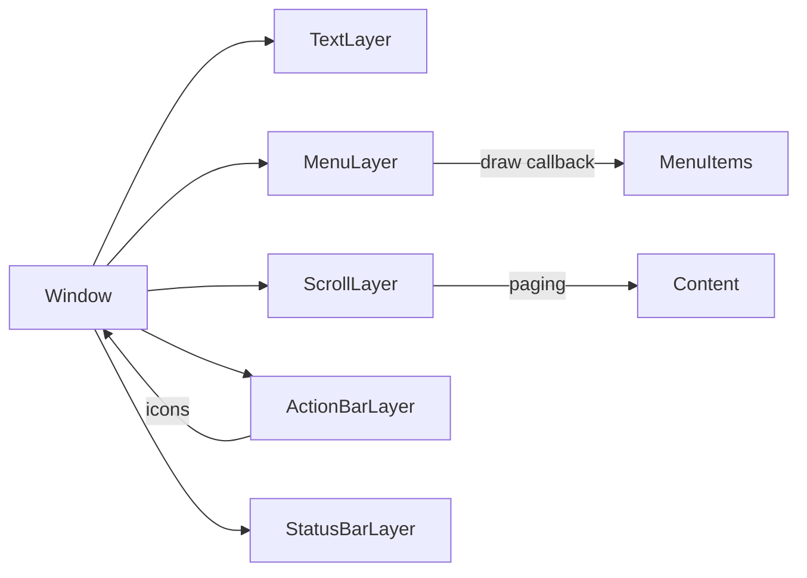

# Pebble Best Practices: UI Design, Layout & Graphics

## Core Principles

Pebble's guides emphasize *simplicity* and *consistency*【3†L72-L84】【20†L95-L102】. Only display what's needed now, with a clear hierarchy of importance【3†L72-L80】【20†L95-L102】. Design for *glanceable* interactions: the user should get the info they need in under 5 seconds.

## Standard Widgets

Favor built-in UI layers instead of custom drawing:

- **Window/Layer**: Each screen is a `Window` containing one or more `Layer`s.
- **TextLayer:** For text. Use system fonts and center/alignment as needed.
- **MenuLayer/SimpleMenuLayer:** For lists or options. Supports sections, optional icons, titles/subtitles【39†L183-L192】.
  ```c
  menu_cell_basic_draw(ctx, cell_layer, "Item Title", "Subtitle", icon_bitmap);
  ```
  Draws a bold title + smaller subtitle and an icon. Title/subtitle fonts are
  theme-driven (`TextStyleFont_MenuCellTitle`/`MenuCellSubtitle` in
  `menu_layer_system_cells.c`), so don't hardcode matching point sizes; the
  single-line `menu_cell_title_draw` helper uses `FONT_KEY_GOTHIC_28`. Menu
  headers use 14pt bold text (`FONT_KEY_GOTHIC_14_BOLD`).
- **ActionBarLayer:** Vertical bar on the right edge with up to 3 icons/buttons【35†L124-L132】. Width varies per platform — 30px on most rectangular watches, 40px on Chalk, 34px on Emery/Gabbro — so always lay out against the `ACTION_BAR_WIDTH` define rather than a literal. Icons should be clear (no wider than 28×18 px, ideally ~15×15 px core)【36†L1-L4】.
  ```c
  action_bar_layer_set_icon(action_bar, BUTTON_ID_UP,   your_icon_up);
  action_bar_layer_set_icon(action_bar, BUTTON_ID_SELECT, your_icon_select);
  ```
- **StatusBarLayer:** Shows system status (time, Bluetooth, battery).
- **ScrollLayer:** For text or images that overflow. On round screens, use pagination【26†L98-L107】. Use `content_indicator` arrows to hint more content【26†L112-L121】.



## Interaction Patterns

- **Cards style:** A single Window showing a "card" of data navigated by up/down【3†L129-L138】.
- **Lists/Menus:** Standard vertical list of options【3†L144-L153】. Use icons for common actions.
- **Action Bar:** For 3 quick actions (e.g. Next/Prev/Add)【35†L124-L132】.
- **Forms/Input:** Use `NumberWindow` for numeric entry. There is no `TextInput` widget in the SDK — free text comes from voice dictation (`dictation_session_create` / `dictation_session_start`) or from canned responses picked via an `ActionMenu`.
- **Feedback:** Always provide immediate feedback (UI update or vibration) for button presses【3†L92-L96】.
- **Navigation:** Up=previous, down=next, consistent throughout【3†L99-L108】. Preserve state (persist last selection) so the user doesn't re-navigate every launch【3†L116-L124】.

## Making Your App Feel Built-In

The firmware's own apps (Music, Alarms, Weather, Workout, Notifications, Send
Text — source under `resources/PebbleOS/src/fw/apps/system/`) share a small
set of conventions. Following them makes a third-party app feel native,
because users' muscle memory from the default apps transfers directly.

### Button paradigms (muscle memory)

What each physical button does across the built-in apps:

| Button | Single click | Long press | Hold (repeating) |
|--------|-------------|------------|------------------|
| **Back** | Pop current window; exits app from the root window (the system default — don't override without strong reason) | *System-reserved*: long-press Back always kills the app; you cannot subscribe to it | — |
| **Up** | Previous item / scroll up / the "positive" action-bar slot (confirm, volume up, skip back) | Secondary variant of the Up action (Music: continuous volume-up, delay `0`) | Scroll/adjust repeatedly |
| **Select** | Primary action: open the focused item, confirm, play/pause | Secondary action: edit, or open an `ActionMenu` of verbs (Alarms long-selects into the alarm editor) | rarely used |
| **Down** | Next item / scroll down / the "negative" action-bar slot (decline, volume down, skip forward) | Secondary variant of the Down action | Scroll/adjust repeatedly |

Standard timing values from the firmware source:

- List scrolling uses `window_single_repeating_click_subscribe(BUTTON_ID_UP/DOWN, 100, ...)` — **100ms** repeat while held (`apps/system/alarms/alarms.c`). `menu_layer_set_click_config_onto_window()` gives you the equivalent default bindings for free.
- "Act immediately on hold" uses `window_long_click_subscribe` with delay **0** (Music volume ramp).
- Destructive confirmations gate behind a long click of **1200ms** (Settings factory reset).

### The action bar, the built-in way

That "black bar at the right with standard icons" is `ActionBarLayer` left at
its defaults — built-in apps **keep the default `GColorBlack` background**
and rely on the stock press animation (icons nudge left ~5px for ~144ms) for
feedback. To replicate:

```c
ActionBarLayer *bar = action_bar_layer_create();
action_bar_layer_set_icon(bar, BUTTON_ID_UP,   confirm_icon);  // check
action_bar_layer_set_icon(bar, BUTTON_ID_DOWN, decline_icon);  // X
action_bar_layer_set_click_config_provider(bar, prv_click_config);
action_bar_layer_add_to_window(bar, window);  // sizes itself to ACTION_BAR_WIDTH × window height
```

Conventional icon-to-button assignments seen across system apps:

- **Confirm/decline pairs:** check on Up, X on Down, nothing on Select (Workout end-dialog, factory reset). Confirm is *always* the top button.
- **Prev/next pairs:** skip-back on Up, skip-forward on Down, play/pause on Select (Music).
- **More options:** an ellipsis ("more") icon that either swaps the action-bar state (Music's Select ellipsis switches Up/Down to volume mode for a few seconds, then auto-reverts) or opens an `ActionMenu`.
- Leave content `ACTION_BAR_WIDTH` narrower than the window so text doesn't run under the bar.

The firmware's standard action-bar icons (white-on-transparent PNGs, all
comfortably inside the 28×18 max — mostly 12–18px) are the look users
recognize. Apps must bundle their own copies, but match these shapes and
sizes:

| Firmware resource | Meaning | Size (px) |
|---|---|---|
| `ACTION_BAR_ICON_CHECK` | confirm / accept | 17×14 |
| `ACTION_BAR_ICON_X` | decline / cancel | 15×16 |
| `ACTION_BAR_ICON_UP` / `_DOWN` | increment / decrement | 12×7 |
| `ACTION_BAR_ICON_MORE` | ellipsis "more options" | 18×4 |
| `ACTION_BAR_ICON_START` / `_PAUSE` | play / pause | 12×16 |
| `ACTION_BAR_ICON_STOP` | stop | 13×13 |
| `ACTION_BAR_ICON_SNOOZE` | snooze | 18×18 |

(The PNG sources live in `resources/PebbleOS/resources/normal/base/images/`
and `resources/common/base/images/` — copy them into your project's
resources as a starting point.)

### ActionMenu for secondary verbs

For item-level operations beyond "open", built-in apps put verbs in an
`ActionMenu` (the full-screen list that slides up): Alarms' Select opens
Delete/Edit Time/Edit Days/…, Send Text's Select opens the response list.
Convention: items are short verb phrases, the menu's background is the app's
accent color (`ActionMenuConfig.colors.background`), and a separator groups
destructive actions.

### One accent color per app

Each system app picks a single accent `GColor` and uses it consistently for
menu highlights, action-menu background, and dialogs — with a black/white
fallback on monochrome platforms:

```c
#define APP_HIGHLIGHT_COLOR PBL_IF_COLOR_ELSE(GColorJaegerGreen, GColorBlack)
menu_layer_set_highlight_colors(menu, APP_HIGHLIGHT_COLOR, GColorWhite);
```

Examples from the firmware: Alarms uses `GColorJaegerGreen`, Watchfaces
`GColorJazzberryJam`, Notifications `GColorFolly`, Send Text
`GColorIslamicGreen`. Foreground over the accent is white (or computed via
`gcolor_legible_over()`); normal rows stay black-on-white.

### Status bar conventions

Built-in non-fullscreen apps show a `StatusBarLayer` at the top and inset
their content by `STATUS_BAR_LAYER_HEIGHT` (16px on most rectangular
platforms, 24px on Chalk, 20px on Emery/Gabbro — use the define). Common
styling: `status_bar_layer_set_colors(bar, GColorClear, GColorBlack)` to
overlay content transparently (Music, Send Text), and
`StatusBarLayerSeparatorModeDotted` for a subtle divider. Fullscreen card
apps (Weather) skip it entirely.

### Dialogs

- `SimpleDialog` — large centered icon + one short line, auto-dismisses (default timeout 1000ms). Used for transient confirmations like "Reminder Added".
- `ActionableDialog` with `DialogActionBarConfirm`/`DialogActionBarDecline`/`DialogActionBarConfirmDecline` — puts the standard check/X action bar on a dialog; Select (or Up/Down for confirm/decline pairs) acts on it.
- `ExpandableDialog` — scrollable longer text, with an optional select action shown as a check icon in its action bar. Used for first-run explainers.

## Layout & Typography

Follow general smartwatch HIGs. Only show the most essential info at a glance【20†L95-L102】【17†L557-L566】.

**Font sizes** (system Raster Gothic, pixel-optimized — available as
`FONT_KEY_GOTHIC_14/18/24/28` plus `_BOLD` variants):
| Use case | Size |
|----------|------|
| Headers/titles | ≥28 pt |
| Main menu items | 24–28 pt (system menu cells are theme-driven; `menu_cell_title_draw` uses 28 pt) |
| Subtitles/secondary | 18 pt |
| Captions | 14 pt |

Ensure **high contrast**: on B/W Pebbles, typically white text on black (or vice versa). Use `gcolor_legible_over()` to pick a contrasting text color for any background【27†L152-L156】.

**Icons:** ActionBar icons ~15×15px core (max 28×18px)【36†L1-L4】. Menu icons ~24×24px. Stick to simple shapes.

## Color & Graphics

**Monochrome (B/W):** Only two colors plus "clear" transparency. Use black/white inversely to maximize contrast. Use macros `PBL_IF_BW_ELSE` or `PBL_IF_COLOR_ELSE`【1†L89-L95】【1†L99-L102】. Prefer solid shapes and thick strokes — small details lose meaning without grayscale.

**Color (64-color palette):** 2 bits per channel (R/G/B), totaling 64 colors【42†L185-L193】. Each RGB component: 0 (off), 1 (dark), 2 (medium), or 3 (full). Colors tend to look pastel under ambient light — pick contrasting hues. Don't rely on red/green differences alone (colorblind users). Use `gcolor_legible_over()` when overlaying text on color backgrounds【27†L152-L156】.

**Dithering:** Subtle gradients require dithering. Keep graphics simple to save RAM and CPU. Darker pixels on Pebble's LCD do *not* save power, but forcing the backlight on drains battery【8†L203-L211】.

## Good vs Bad Design Examples

**Good:** The "Readable" watchface increased hand thickness and added quarter-hour numerals【29†L63-L72】【29†L90-L98】. Legible even under low light or at an angle【29†L70-L72】. Used Pebble's strengths (simple shapes, bitmaps) and avoided complexity.

**Bad:** A weather app requiring 3 menu taps to view conditions interrupts glanceability. A watchface with small icons and grey-on-black text is unusable outdoors. Using many vivid colors on monochrome shows as uniform grey.

## Checklist

- Use system fonts (Raster Gothic) at recommended sizes: ≥28pt titles, 24–28pt menus, 18pt subtitles, 14pt captions.
- Use standard SDK widgets (MenuLayer, ActionBarLayer, ScrollLayer) over custom drawing.
- Follow built-in button paradigms: Up/Down = prev/next or scroll (100ms repeat when held), Select = primary action, long-Select = secondary verbs (ActionMenu), Back = pop window (don't override).
- Action bar: keep the default black background, confirm on Up / decline on Down, layout against `ACTION_BAR_WIDTH` (30/34/40px per platform), icons ~15×15px core, max 28×18px.
- Pick one accent color with a `PBL_IF_COLOR_ELSE(accent, GColorBlack)` fallback and use it for menu highlights, action menus, and dialogs.
- Inset content by `STATUS_BAR_LAYER_HEIGHT` when showing a status bar.
- Provide immediate feedback (visual + vibration) on every interaction.
- Use `gcolor_legible_over()` for text on colored backgrounds.
- Don't rely on color alone for meaning — accompany with symbols or text.
- Menu icons: ~24×24px.
- Favor cards or lists over deep nested menus.
- Persist navigation state so users don't re-navigate on each launch.
