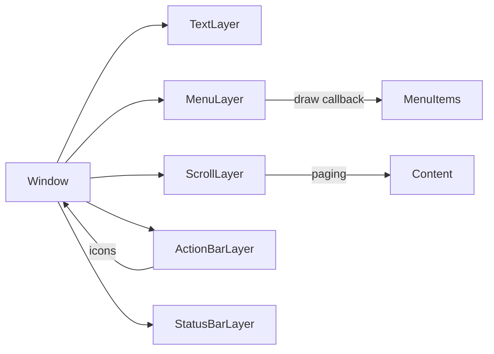

# Pebble Best Practices: UI Design, Layout & Graphics

## Core Principles

Pebble's guides emphasize *simplicity* and *consistency*【3†L72-L84】【20†L95-L102】. Only display what's needed now, with a clear hierarchy of importance【3†L72-L80】【20†L95-L102】. Design for *glanceable* interactions: the user should get the info they need in under 5 seconds.

## Standard Widgets

Favor built-in UI layers instead of custom drawing:

- **Window/Layer**: Each screen is a `Window` containing one or more `Layer`s.
- **TextLayer:** For text. Use system fonts and center/alignment as needed.
- **MenuLayer/SimpleMenuLayer:** For lists or options. Supports sections, optional icons, titles/subtitles【39†L183-L192】.
  ```c
  menu_cell_basic_draw(ctx, cell_layer, "Item Title", "Subtitle", icon_bitmap);
  ```
  Draws 24pt title + 18pt subtitle font【39†L183-L192】 and an icon. Menu headers use 14pt text【39†L238-L240】.
- **ActionBarLayer:** Vertical bar (30px wide) on the right with up to 3 icons/buttons【35†L124-L132】. Icons should be clear (no wider than 28×18 px, ideally ~15×15 px core)【36†L1-L4】.
  ```c
  action_bar_layer_set_icon(action_bar, BUTTON_ID_UP,   your_icon_up);
  action_bar_layer_set_icon(action_bar, BUTTON_ID_SELECT, your_icon_select);
  ```
- **StatusBarLayer:** Shows system status (time, Bluetooth, battery).
- **ScrollLayer:** For text or images that overflow. On round screens, use pagination【26†L98-L107】. Use `content_indicator` arrows to hint more content【26†L112-L121】.



## Interaction Patterns

- **Cards style:** A single Window showing a "card" of data navigated by up/down【3†L129-L138】.
- **Lists/Menus:** Standard vertical list of options【3†L144-L153】. Use icons for common actions.
- **Action Bar:** For 3 quick actions (e.g. Next/Prev/Add)【35†L124-L132】.
- **Forms/Input:** Use `NumberWindow` for numeric entry, `TextInput` or long-press for text/dictation.
- **Feedback:** Always provide immediate feedback (UI update or vibration) for button presses【3†L92-L96】.
- **Navigation:** Up=previous, down=next, consistent throughout【3†L99-L108】. Preserve state (persist last selection) so the user doesn't re-navigate every launch【3†L116-L124】.

## Layout & Typography

Follow general smartwatch HIGs. Only show the most essential info at a glance【20†L95-L102】【17†L557-L566】.

**Font sizes** (system Raster Gothic, pixel-optimized):
| Use case | Size |
|----------|------|
| Headers/titles | ≥28 pt |
| Main menu items | 24 pt |
| Subtitles/secondary | 18 pt |
| Captions | 14 pt |

Ensure **high contrast**: on B/W Pebbles, typically white text on black (or vice versa). Use `gcolor_legible_over()` to pick a contrasting text color for any background【27†L152-L156】.

**Icons:** ActionBar icons ~15×15px core (max 28×18px)【36†L1-L4】. Menu icons ~24×24px. Stick to simple shapes.

## Color & Graphics

**Monochrome (B/W):** Only two colors plus "clear" transparency. Use black/white inversely to maximize contrast. Use macros `PBL_IF_BW_ELSE` or `PBL_IF_COLOR_ELSE`【1†L89-L95】【1†L99-L102】. Prefer solid shapes and thick strokes — small details lose meaning without grayscale.

**Color (64-color palette):** 2 bits per channel (R/G/B), totaling 64 colors【42†L185-L193】. Each RGB component: 0 (off), 1 (dark), 2 (medium), or 3 (full). Colors tend to look pastel under ambient light — pick contrasting hues. Don't rely on red/green differences alone (colorblind users). Use `gcolor_legible_over()` when overlaying text on color backgrounds【27†L152-L156】.

**Dithering:** Subtle gradients require dithering. Keep graphics simple to save RAM and CPU. Darker pixels on Pebble's LCD do *not* save power, but forcing the backlight on drains battery【8†L203-L211】.

## Good vs Bad Design Examples

**Good:** The "Readable" watchface increased hand thickness and added quarter-hour numerals【29†L63-L72】【29†L90-L98】. Legible even under low light or at an angle【29†L70-L72】. Used Pebble's strengths (simple shapes, bitmaps) and avoided complexity.

**Bad:** A weather app requiring 3 menu taps to view conditions interrupts glanceability. A watchface with small icons and grey-on-black text is unusable outdoors. Using many vivid colors on monochrome shows as uniform grey.

## Checklist

- Use system fonts (Raster Gothic) at recommended sizes: ≥28pt titles, 24pt menus, 18pt subtitles, 14pt captions.
- Use standard SDK widgets (MenuLayer, ActionBarLayer, ScrollLayer) over custom drawing.
- Provide immediate feedback (visual + vibration) on every interaction.
- Use `gcolor_legible_over()` for text on colored backgrounds.
- Don't rely on color alone for meaning — accompany with symbols or text.
- ActionBar icons: ~15×15px core, max 28×18px. Menu icons: ~24×24px.
- Favor cards or lists over deep nested menus.
- Persist navigation state so users don't re-navigate on each launch.
